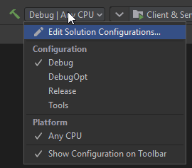

# Build Configurations

C# (well, technically, MSBuild) has a system known as ["build configurations"](https://learn.microsoft.com/en-us/visualstudio/ide/understanding-build-configurations?view=vs-2022). Basically, you get a nice drop-down menu in Visual Studio (or Rider) that allows you to change how your code is compiled and ran.

In a default C# project, you have two configurations: `Debug` and `Release`.
* `Debug` has debug checks (e.g. asserts) enabled, and is compiled/ran without optimizations[^optimizations].
* `Release` has no debug checks and is compiled *with* optimizations.

In RobustToolbox, there are various development tools that cannot be included in live release builds. Examples of this are the `csi` C# Interactive prompt, for security reasons. These tools are generally compiled in behind the `TOOLS` [preprocessor define](./preprocessor-defines.md), which is also how they are turned off.

Furthermore, during game development it might generally be useful to run optimizations more frequently than usual. Not getting a stable framerate on a debug build can make testing rather painful, but simply switching from `Debug` to `Release` in the default C# model also gets rid of checks like asserts, which does change behavior and might cause you to miss issues.

Because of this, we have the following set of configurations in our solutions:

* `Debug`: has debug checks, tools, and no optimizations.
* `DebugOpt`: is like `Debug`, but with optimizations enabled.
* `Tools`: no debug checks, but tools and optimizations enabled. This is what you'd use when **mapping**.
* `Release`: no debug checks, no tools, optimizations enabled. This is intended to be as close to a live launcher build as you can get.

[^optimizations]: Having optimizations enabled generally makes it harder for tools like debuggers to give accurate information, so that's why they're off on debug builds. 

## How to use these

### Rider

Select from that drop-down at the top of the window.

### Visual Studio

I'm too lazy to find a screenshot, but the drop-down looks kinda similar to Rider.

### Visual Studio Code

TODO

